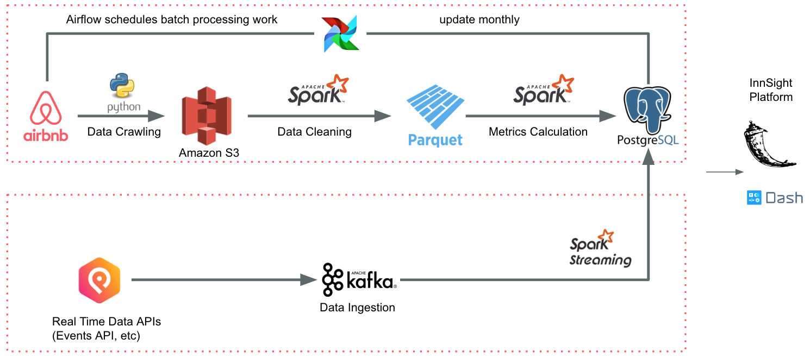

# Innsight

## Introduction

InnSight is a platform providing Airbnb hosts insight on Airbnb rental properties and local market dynamics.

## Architecture

The platform architecture is shown in the following figure.

The top half of the platform architecture is composed of the following:
- Dataset from [InsideAirbnb](http://insideairbnb.com/get-the-data.html).
    * Historical datasize is approximately 250GB.
    * New data is added at approximately 10GB per month.
- [Python](https://www.python.org/) script is used to move the InsideAirbnb dataset into [AWS S3](https://aws.amazon.com/s3/).
- [Spark](https://spark.apache.org/) is used to read the data from S3, unify the raw data into a common schema and to remove duplicates. The results are then stored into [Parquet](https://parquet.apache.org/).
- Spark is used again to read the data from Parquet, and to perform metrics calculation and then store the results into [Postgres](https://www.postgresql.org/).
- [Airflow](https://airflow.apache.org/) is used to run the above stages once per month as new data arrives.
- [Flask](https://flask.palletsprojects.com/en/2.0.x/) is used to present the data from Postgres in a [Dash](https://plotly.com/dash/) UI.

The bottom half of the platform architecture is composed of the following:
- Real-time booking data.
    * Simulated for now, but can be fetched from APIs e.g., the PredictHQ Events data [API](https://www.predicthq.com/apis).
- [Kafka](https://kafka.apache.org/) ingests the real-time data and passes it to [Spark Streaming](https://spark.apache.org/docs/latest/streaming-programming-guide.html).
- Spark Streaming processes the real-time data and stores it in Postgres.
- Flask is used to present the data from Postgres in a Dash UI.

## File Description

- `src/data_fetch/data_fetch.sh`
    * Generates list of download links.
    * Runs `download_rename.py` to download data from each link.
    * Pushes data to AWS S3.
    * This script is run periodically from Airflow to update dataset.
- `src/data_fetch/download_rename.py`
    * Auxiliary function to download data from a given download link.
    * Used by `data_fetch.sh`.
- `src/batch_processing/data_cleaning_to_db_batch.py`
    * Spark job that reads data from AWS S3, cleans the data and writes it to Postgres.
- `src/batch_processing/data_cleaning_to_parquet_batch.py`
    * Spark job that reads data from AWS S3, cleans the data and writes it to Parquet in AWS S3.
- `src/batch_processing/metrics_calculation_batch.py`
    * Spark job that reads cleaned data from Postgres, performs metrics calculation using dataframe methods and Spark SQL queries, and writes results back to Postgres.
    * Note: The Spark job for reading from Parquet in AWS S3 does not seem to be present.
- `src/batch_processing/s3_urls_generation.sh`
    * Grabs all the AWS S3 URLs created by `data_fetch.sh`.
    * Writes them all into a file which is read by the `data_cleaning*.py` scripts.
- `src/airflow/dags/listing_stats_batch.py`
    * Defines Airflow DAG from raw data to Postgres.
    * This DAG is run once.
- `src/streaming_processing/booking_events_simulator.py`
    * Uses [Faker](https://faker.readthedocs.io/en/master/) Python package to generate a text file of fake booking events.
- `src/streaming_processing/booking_producer.py`
    * Uses Kafka Python package to create a [Producer](https://kafka-python.readthedocs.io/en/master/apidoc/KafkaProducer.html) that sends each of the events created by Faker to a Kafka topic.
    * The setup assumes the Kafka cluster is set up on localhost.
- `src/streaming_processing/booking_spark_streaming.py`
    * Uses Spark Streaming to read from Kafka topic then convert each record (RDD) into a DataFrame and write it to Postgres.

## Possible Improvements

- `src/data_fetch/data_fetch.sh`
    * Do not decompress raw data locally and upload to AWS S3.
    * Just have Spark directly read `.gz` files.
- Add `src/batcg_processing/metrics_calculation_batch_parquet.py` to read data from Parquet in AWS S3.
- Check if any improvements can be made to Spark SQL calls in metrics calculation
