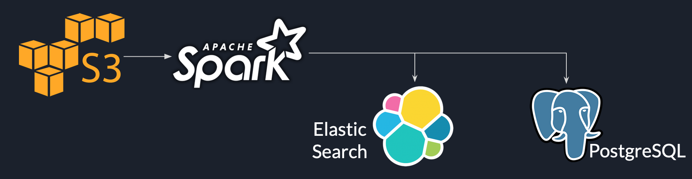
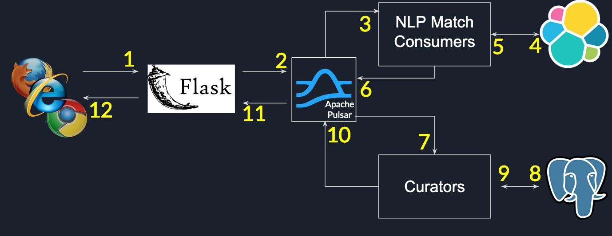

# you-complete-me

## Introduction

This project creates a real-time data pipeline for providing suggestions based on semantic information to users posting questions on social media platforms.

[Demo](https://www.youtube.com/watch?v=at1oKQ8z4aU) and [slides](https://docs.google.com/presentation/d/1Mul35kcTs_uO0nq-HNzs_09jkEVuctAkxtE7EwbCvIg) are available in the provided links.

## Problem Statement

The goal of this project is to provide real-time suggestions while users are composing messages. This allows users to ask richer questions e.g., non-duplicates. This will require a real-time data pipeline.

## Existing Solutions

Platforms (e.g., Google, Stack Overflow) provide auto-complete based suggestions which are generated using prefix-based string comparisons. This project compares semantic information in the text with similar questions that have been already posted. By inferring the meaning behind the question, we can provide more relevant suggestions than conventional solutions.

## Technology stack

This project has a batch and streaming pipeline.

The batch pipeline serves as the Extract-Transform-Load (ETL) pipeline. [Raw data](https://files.pushshift.io/stackexchange) is stored in Amazon S3 as a collection of files in the NDJSON [format](http://ndjson.org/). We use Apache Spark to extract questions from the raw data and index them in AWS Elasticsearch. We also extract question metadata (e.g., creation date) using Spark and save them in a PostgreSQL database.

The real-time pipeline is built using [Apache Pulsar](https://pulsar.apache.org/) as the backbone. User queries received by the web-server (1) are published to Pulsar message brokers (2). Consumers listening to the `get-suggestions` topic receive these messages from the broker (3) and query Elasticsearch (4, 5). Query responses are published to the `curate` topic (6) where a group of curators rank the response based on a simple heuristic using metadata available in PostgreSQL (7, 8 and 9). The ranked suggestions are sent back to the user by the web-server listening to messages published in the `suggestions-list` topic (10, 11, and 12).

## Data source

A subset of the [stackexchange](https://files.pushshift.io/stackexchange) dataset.

## File Description

